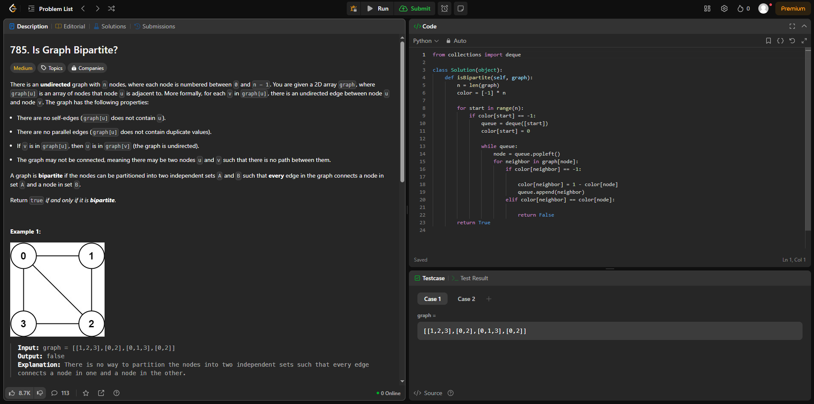

# Grafos1_Exercicios
**Número da Lista**: X 
**Conteúdo da Disciplina**: Grafos 1 

## Alunos
|Matrícula | Aluno |
| -- | -- |
| 222006712 | Fábio Gabriel da Silva Barbosa |
| 221022696 | Nathan Benigno Ponce de Abreu |

## Sobre 

### Questões Médias
| Título | Responsável | 
| -- | -- | 
| Number of Islands | Fábio gabriel | 
| Is Graph Bipartite?| Nathan Abreu | 

### Questões Difíceis
| Título | Responsável | 
| -- | -- | 
| Build a Matrix With Conditions | Fábio Gabriel | 
| Binary Tree Maximum Path Sum | Nathan Abreu | 

## Screenshots

### [Number of Islands](https://leetcode.com/problems/number-of-islands/?envType=problem-list-v2&envId=breadth-first-search)

### [Build a Matrix With Conditions](https://leetcode.com/problems/build-a-matrix-with-conditions/description/?envType=problem-list-v2&envId=topological-sort)

### [Is graph Bipartite?](https://leetcode.com/problems/is-graph-bipartite/description/)

### [Binary Tree Maximum Path Sum](https://leetcode.com/problems/binary-tree-maximum-path-sum/?envType=problem-list-v2&envId=depth-first-search)

## Link do vídeo

https://www.youtube.com/watch?v=UpvuFKI2WCw

## Instalação 
**Linguagem**: C, Python  

## Outros 
Quaisquer outras informações sobre seu projeto podem ser descritas abaixo.